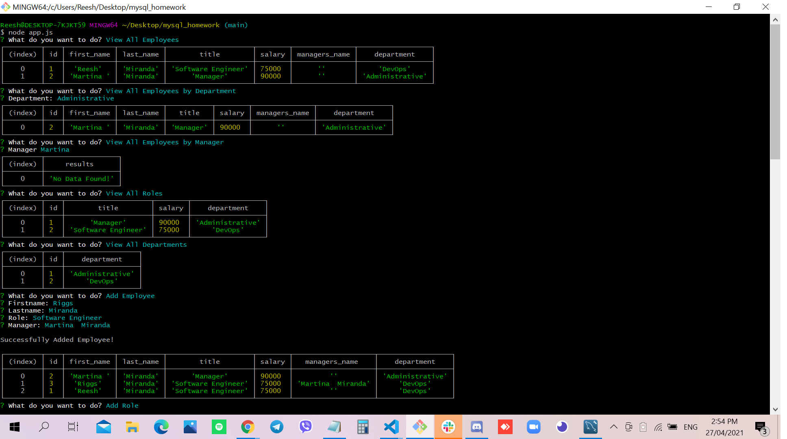

# Employee Tracker

## Site Picture


## Technologies Used
- Javascript - adds special effects on pages
- Node.js - an open source server environment that uses JavaScript on the server
-MySQL - fully managed database service to deploy cloud-native applications.
- GitBash - for cloning repository and pushing code to GitHub
- GitHub - holds repository that deploys to GitHub Pages

## Summary
This file contains code that creates an Employee Tracker. It also contains code that was created using Javascript and Node.js. 

## Code Snippet
```html
connection.connect((err) => {
    if (err) throw err;
    initialQuestions();
  });
  
  const initialQuestions = () => {
    inquirer
        .prompt(
            {
                type: 'list',
                message: 'What do you want to do?',
                name: 'choice',
                choices: [
                  'View All Employees',
                  'View All Employees by Department',
                  'View All Employees by Manager',
                  'View All Roles',
                  'View All Departments',
                  'Add Employee',
                  'Add Role',
                  'Add Department',
                  'Remove Employee',
                  'Remove Role',
                  'Remove Department'
                ]
            })
        .then((response) => {
          const { choice } = response;
          switch (choice) {
            case 'View All Employees':
              viewAllEmployees();
              break;
            case 'View All Employees by Department':
              viewAllEmployeesByDepartment();
              break;
            case 'View All Employees by Manager':
              viewAllEmployeesByManager();
              break;
            case 'View All Roles':
              viewAllRolesWithSalaries();
              break;
            case 'View All Departments':
              viewAllDepartments();
              break;
            case 'Add Employee':
              addEmployee();
              break;
            case 'Add Role':
              addRole();
              break;
            case 'Add Department':
              addDepartment();
              break;
            case 'Remove Employee':
              removeEmployee();
              break;
            case 'Remove Role':
              removeRole();
              break;
            case 'Remove Department':
              removeDepartment();
              break;
          }
        });
  };
  ```

```html
<html>

</html>
```
## Author Links 
[LinkedIn](https://www.linkedin.com/in/rosario-miranda-b81170132/)<br />
[GitHub](https://github.com/rtmiranda18)
